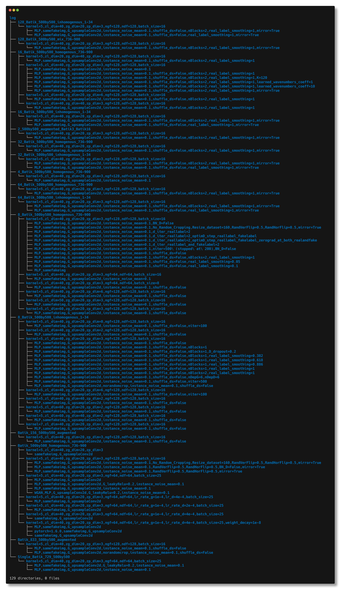
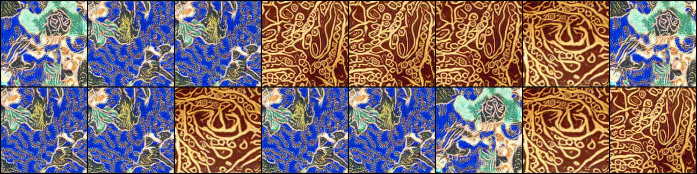
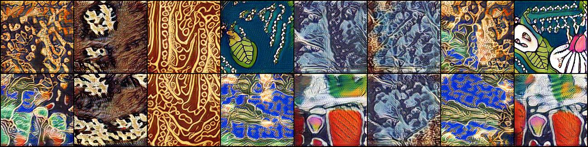
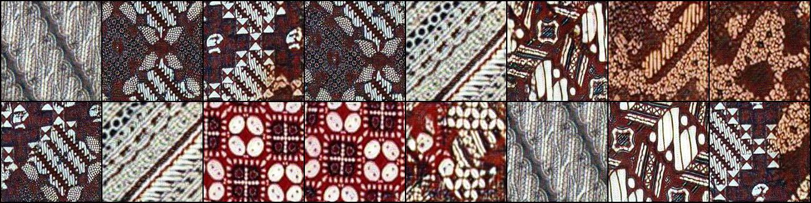
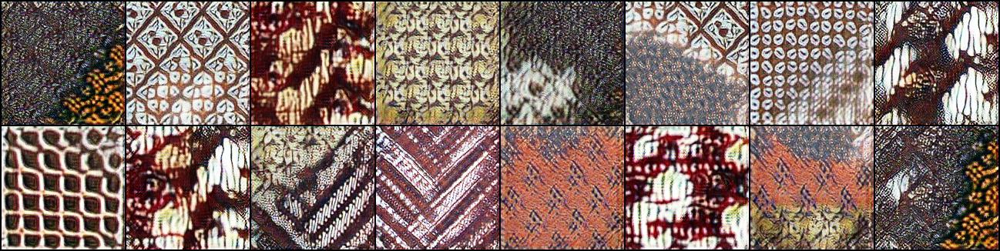
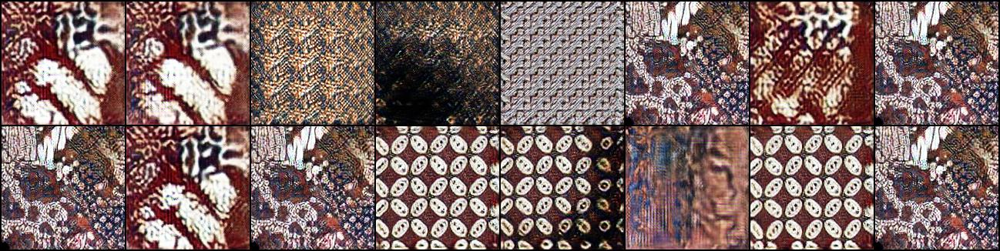
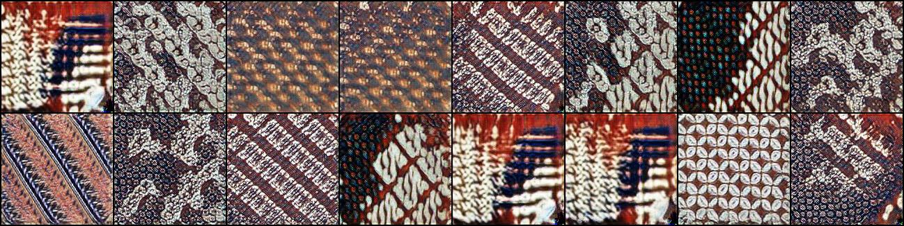

# PSGAN Batik

Pytorch implementation of the paper "Learning Texture Manifolds with the Periodic Spatial GAN" to work on batik images. Original paper is available at https://arxiv.org/pdf/1705.06566.pdf.

Tested to work on Ubuntu 16.04, Pytorch 0.4, Python 3.6. Nvidia Quadro P5000 16GB. Using rented GPU on Paperspace GPU Cloud Provider.

Image below shows directories of experiments concluded.

Generated textures:

log/2_500by500_augmented_Batik3_Batik16/kernel=5,zl_dim=40,zg_dim=20,zp_dim=3,ngf=128,ndf=128,batch_size=16/MLP,samefakeimg,G_upsampleConv2d,instance_noise_mean=0.1,shuffle_ds=False,nBlocks=2,real_label_smoothing=1/generated_textures_099.jpg

 
log/8_Batik_500by500_inhomogenous_1-34/kernel=5,zl_dim=40,zg_dim=20,zp_dim=3,ngf=128,ndf=128,batch_size=16/MLP,samefakeimg,G_upsampleConv2d,instance_noise_mean=0.1,shuffle_ds=False,nBlocks=2,real_label_smoothing=1/generated_textures_098.jpg

 
log/8_Batik_500by500_homogenous_736-900/kernel=5,zl_dim=40,zg_dim=20,zp_dim=3,ngf=128,ndf=128,batch_size=16/MLP,samefakeimg,G_upsampleConv2d,instance_noise_mean=0.1,shuffle_ds=False,nBlocks=2,real_label_smoothing=1/generated_textures_099.jpg

 
log/32_Batik_500by500_homogenous_736-900/kernel=5,zl_dim=40,zg_dim=20,zp_dim=3,ngf=128,ndf=128,batch_size=16/MLP,samefakeimg,G_upsampleConv2d,instance_noise_mean=0.1,shuffle_ds=False,nBlocks=2,real_label_smoothing=1/generated_textures_099.jpg

 
log/64_Batik_500by500_homogenous_736-900/kernel=5,zl_dim=40,zg_dim=20,zp_dim=3,ngf=128,ndf=128,batch_size=16/MLP,samefakeimg,G_upsampleConv2d,instance_noise_mean=0.1,shuffle_ds=False,nBlocks=2,real_label_smoothing=1/generated_textures_099.jpg

 
log/128_Batik_500by500_mix_736-900/kernel=5,zl_dim=40,zg_dim=20,zp_dim=3,ngf=128,ndf=128,batch_size=16/MLP,samefakeimg,G_upsampleConv2d,instance_noise_mean=0.1,shuffle_ds=False,nBlocks=2,real_label_smoothing=1/generated_textures_099.jpg

This repository is forked from https://github.com/zalandoresearch/famos.